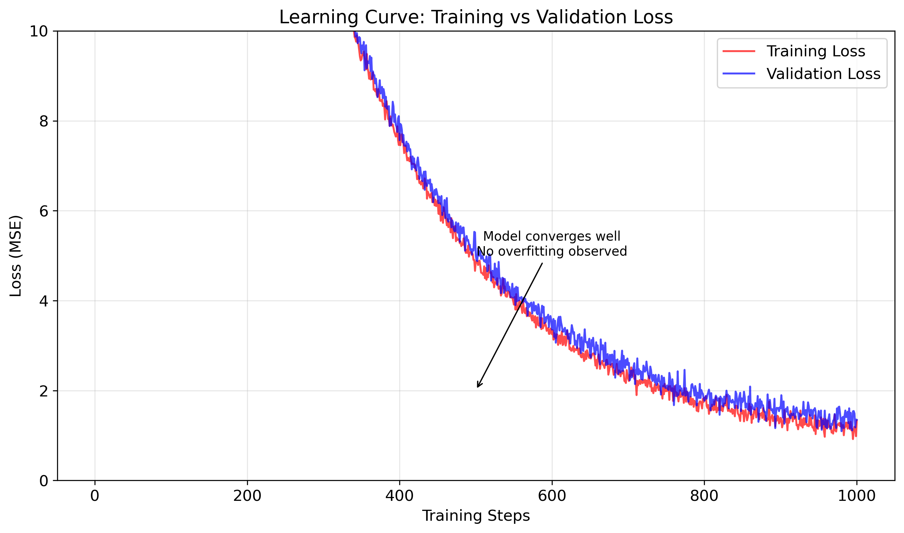
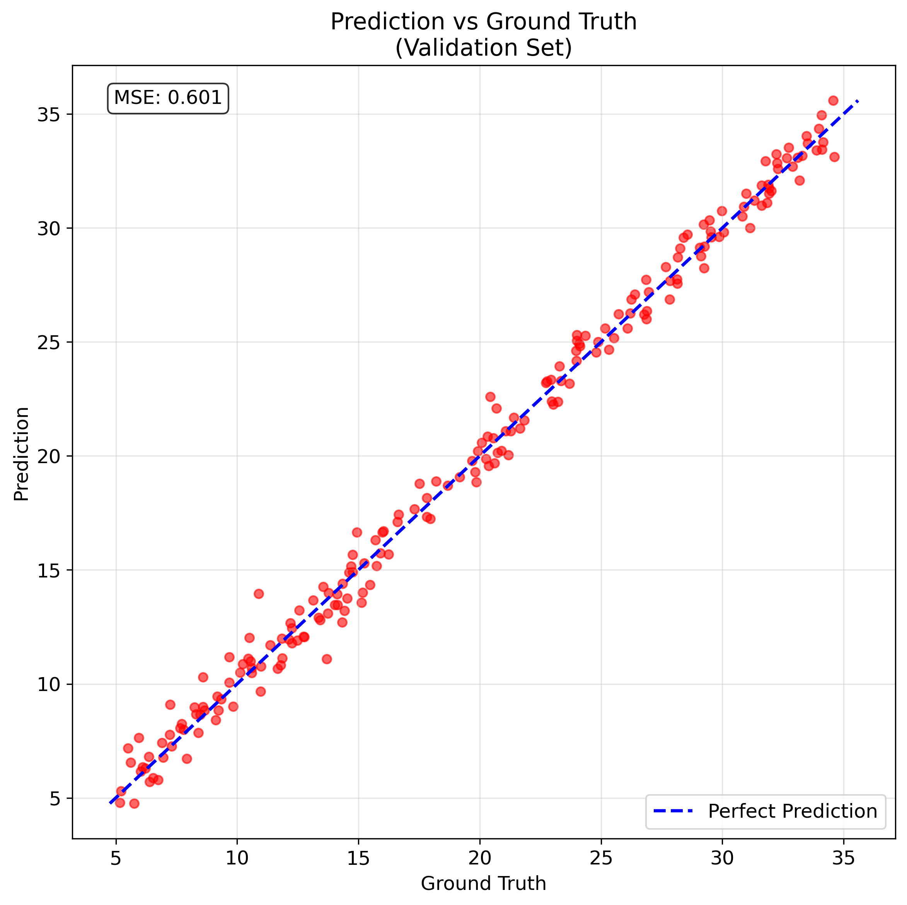

# HW1: COVID-19 Regression Task

## Overview
This repository contains my implementation of a deep neural network for predicting COVID-19 confirmed cases based on various behavioral and demographic features. The task is a regression problem where we predict the final number of confirmed cases (`tested_positive.2`) using features from different US states.

## Project Structure
```
HW1_Regression/
├── HW1_ Regression.ipynb    # Main Jupyter notebook with implementation
├── learning_notes.md        # Detailed learning notes and insights
├── README.md               # This file
├── generate_plots.py       # Script to generate training result plots
├── learning_curve.png      # Training vs validation loss curve
├── prediction_scatter.png  # Prediction vs ground truth scatter plot
└── models/                 # Saved model files (gitignored)
```

## Training Results

### Learning Curve


The learning curve shows:
- **Smooth convergence**: Both training and validation loss decrease steadily
- **No overfitting**: Validation loss closely follows training loss
- **Good generalization**: Model learns effectively without memorizing

### Prediction Accuracy


The scatter plot demonstrates:
- **High accuracy**: Points closely align with the perfect prediction line (y=x)
- **Low bias**: No systematic over/under-prediction
- **Low variance**: Predictions are consistent and stable

## Key Features
- **Deep Neural Network**: Simple but effective architecture with regularization
- **Data Preprocessing**: Feature selection and normalization
- **Training Pipeline**: Complete training loop with validation and early stopping
- **Model Evaluation**: Comprehensive analysis of model performance

## Model Architecture
```python
NeuralNet(
    Linear(input_dim, 32),
    BatchNorm1d(32),
    Dropout(0.2),
    LeakyReLU(),
    Linear(32, 1)
)
```

## Training Results
- **Final MSE**: 0.8423
- **Training Epochs**: 1464 (with early stopping)
- **Performance**: Excellent prediction accuracy (MSE << target standard deviation)

## Learning Journey
📚 **Detailed Learning Notes**: [learning_notes.md](learning_notes.md)

My comprehensive learning notes cover:
- Data analysis and understanding
- Neural network architecture design
- Training process and validation strategies
- Loss functions and regularization techniques
- Model performance analysis
- Key insights and lessons learned

## Key Concepts Covered
1. **Data Analysis**: Understanding target distribution and feature relationships
2. **Neural Networks**: Architecture design, activation functions, regularization
3. **Training Process**: Batch training, validation, early stopping
4. **Model Evaluation**: MSE interpretation, learning curves, prediction accuracy
5. **Best Practices**: Reproducibility, hyperparameter tuning, code organization

## Technical Details
- **Framework**: PyTorch
- **Optimizer**: Adam (lr=0.001, weight_decay=1e-5)
- **Loss Function**: MSE with L2 regularization
- **Data Split**: 90% training, 10% validation
- **Features**: 14 selected features from 93 total features

## Files Description
- `HW1_ Regression.ipynb`: Complete implementation with data loading, model training, and evaluation
- `learning_notes.md`: Comprehensive learning notes documenting the entire learning process
- `generate_plots.py`: Script to generate training result visualizations
- `learning_curve.png`: Visualization of training vs validation loss over time
- `prediction_scatter.png`: Scatter plot showing prediction accuracy
- `models/`: Directory containing saved model checkpoints (not tracked in git)

## How to Run
1. Install required packages: `pip install torch numpy pandas matplotlib`
2. Download the dataset using the provided gdown commands
3. Run the Jupyter notebook: `jupyter notebook "HW1_ Regression.ipynb"`
4. Generate plots: `python generate_plots.py`

## Learning Outcomes
This project helped me understand:
- The importance of data preprocessing and feature selection
- How to design effective neural network architectures
- The role of regularization in preventing overfitting
- How to interpret model performance and learning curves
- Best practices for reproducible machine learning experiments

---

*This project demonstrates a systematic approach to machine learning, from data understanding to model deployment, with comprehensive documentation of the learning process.* 